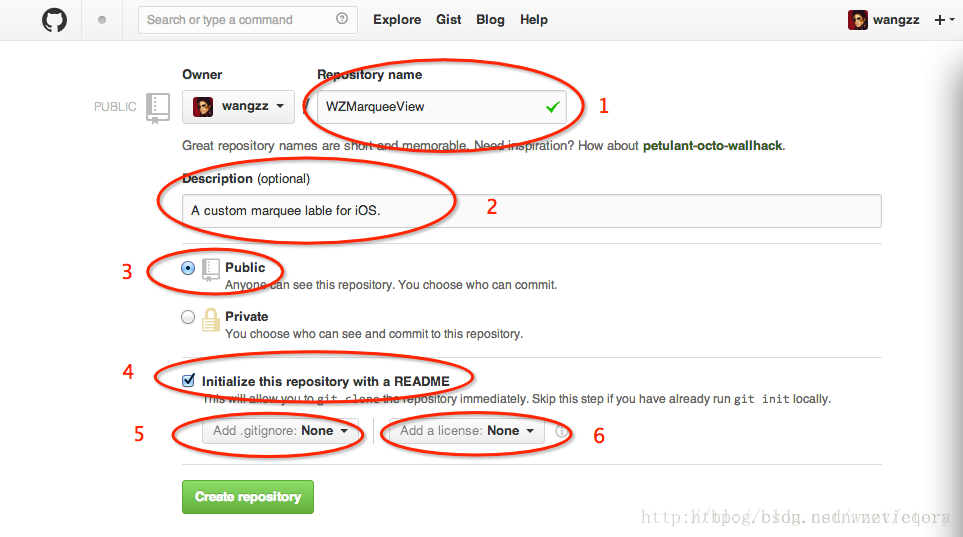
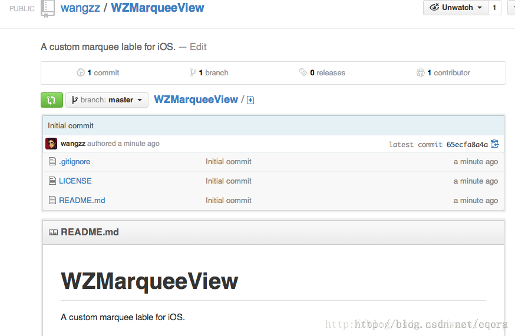
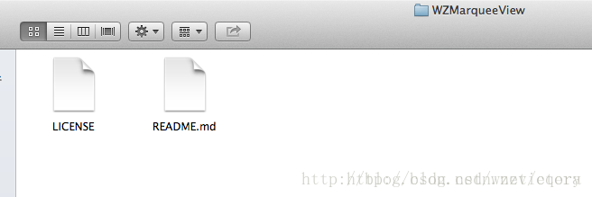

#创建自己的github仓库

CocoaPods都托管在github上(官方链接为：https://github.com/CocoaPods)，所有的Pods依赖库也都依赖github，因此第一步我们需要创建一个属于自己的github仓库。仓库创建界面如下图：
技术分享

 上图中标了序号的共6处，对应的说明如下：
>1、Repository name
仓库名称，这里写成WZMarqueeView，必填的；

>2、Description
仓库的描述信息，可选的；

>3、仓库的公开性
这里只能选Public，一个是因为Private是要money的，再一个Private别人看不到还共享个毛；

>4、是否创建一个默认的README文件
一个完整地仓库，都需要README说明文档，建议选上。当然不嫌麻烦的话你也可以后面再手动创建一个；

>5、是否添加.gitignore文件
.gitignore文件里面记录了若干中文件类型，凡是该文件包含的文件类型，git都不会将其纳入到版本管理中。是否选择看个人需要；

>6、license类型
正规的仓库都应该有一个license文件，Pods依赖库对这个文件的要求更严，是必须要有的。因此最好在这里让github创建一个，也可以自己后续再创建。我使用的license类型是MIT。
 
上面的各项都填写完毕后，点击Create repository按钮即可，创建成功地界面如图
技术分享

到这，仓库创建过程就结束了。

#clone仓库到本地

为了便于向仓库中删减内容，需要先将仓库clone到本地，操作方式有多种，推荐使用命令行：

$ git clone https://github.com/wangzz/WZMarqueeView.git  
操作完成后，github上对应的文件都会拷贝到本地，目录结构为：

github上仓库中的.gitignore文件是以.开头的隐藏文件，因此这里只能看到两个。
后续我们的所有文件增、删、改都在这个目录下进行。