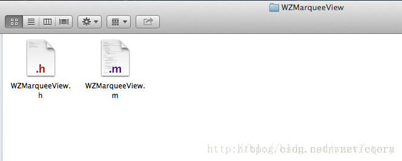
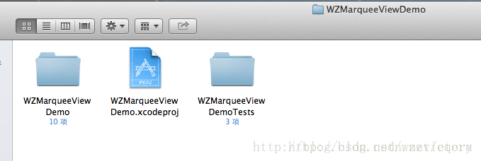
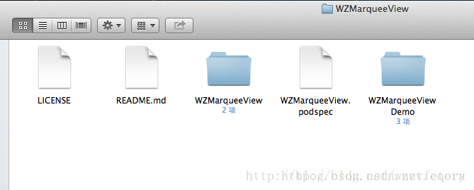

#向本地git仓库中添加创建Pods依赖库所需文件

注意：以下描述的文件都要放在步骤二clone到本地的git仓库的根目录下面。
### 1、后缀为.podspec文件

该文件为Pods依赖库的描述文件，每个Pods依赖库必须有且仅有那么一个描述文件。文件名称要和我们想创建的依赖库名称保持一致，我的WZMarqueeView依赖库对应的文件名为WZMarqueeView.podspec。


> 1.1 podspec文件内容

> WZMarqueeView.podspec的保存内容为

```ruby
Pod::Spec.new do |s|  
  s.name             = "WZMarqueeView"  
  s.version          = "1.0.0"  
  s.summary          = "A marquee view used on iOS."  
  s.description      = <<-DESC  
                       It is a marquee view used on iOS, which implement by Objective-C.  
                       DESC  
  s.homepage         = "https://github.com/wangzz/WZMarqueeView"  
  # s.screenshots      = "www.example.com/screenshots_1", "www.example.com/screenshots_2"  
  s.license          = ‘MIT‘  
  s.author           = { "王中周" => "wzzvictory_tjsd@163.com" }  
  s.source           = { :git => "https://github.com/wangzz/WZMarqueeView.git", :tag => s.version.to_s }  
  # s.social_media_url = ‘https://twitter.com/NAME‘  
  
  s.platform     = :ios, ‘4.3‘  
  # s.ios.deployment_target = ‘5.0‘  
  # s.osx.deployment_target = ‘10.7‘  
  s.requires_arc = true  
  
  s.source_files = ‘WZMarqueeView/*‘  
  # s.resources = ‘Assets‘  
  
  # s.ios.exclude_files = ‘Classes/osx‘  
  # s.osx.exclude_files = ‘Classes/ios‘  
  # s.public_header_files = ‘Classes/**/*.h‘  
  s.frameworks = ‘Foundation‘, ‘CoreGraphics‘, ‘UIKit‘  
  
end  
```

该文件是ruby文件，里面的条目都很容易知道含义。
其中需要说明的又几个参数：
①s.license
Pods依赖库使用的license类型，大家填上自己对应的选择即可。
②s.source_files
表示源文件的路径，注意这个路径是相对podspec文件而言的。
③s.frameworks
需要用到的frameworks，不需要加.frameworks后缀。

>1.2 如何创建podspec文件

大家创建自己的podspec文件可以有两个途径：
①copy我的podspec文件然后修改对应的参数，推荐使用这种方式。
②执行以下创建命令：
[ruby] view plaincopy技术分享技术分享
 
 

$ pod spec create WZMarqueeView  
也会创建名为WZMarqueeView.podspec的文件。但是打开创建完的文件你就会发现里面的东西太多了，很多都是我们不需要的。
 
### 2、LICENSE文件

CocoaPods强制要求所有的Pods依赖库都必须有license文件，否则验证不会通过。license的类型有很多种，详情可以参考网站tl;dr Legal。在创建github仓库的时候，我已经选择了MIT类型的license。
 
### 3、主类文件

创建Pods依赖库就是为了方便别人使用我们的成果，比如我想共享给大家的WZMarqueeView类，是我想提供给广大用户使用的，这个类自然是必不可少的。我把这个类包含的两个文件放到一个名称为WZMarqueeView的文件夹中，对应的目录结构如图：


### 4、demo工程

为了快速地教会别人使用我们的Pods依赖库，通常需要提供一个demo工程。我创建的demo工程放到了一个名为WZMarqueeViewDemo的文件夹中，该目录包含的文件如下图所示：
技术分享


### 5、README.md

使用github的人应该都熟悉这个文件，它是一个成功github仓库必不可少的一部分，使用的是markdown标记语言，用于对仓库的详细说明。
 
以上所说的5个是创建Pods依赖库所需最基础的文件，其中1、2、3是必需的，4、5是可选但强烈推荐创建的。
添加完这些文件以后，我的github本地仓库目录就变成了下图所示的样子：

