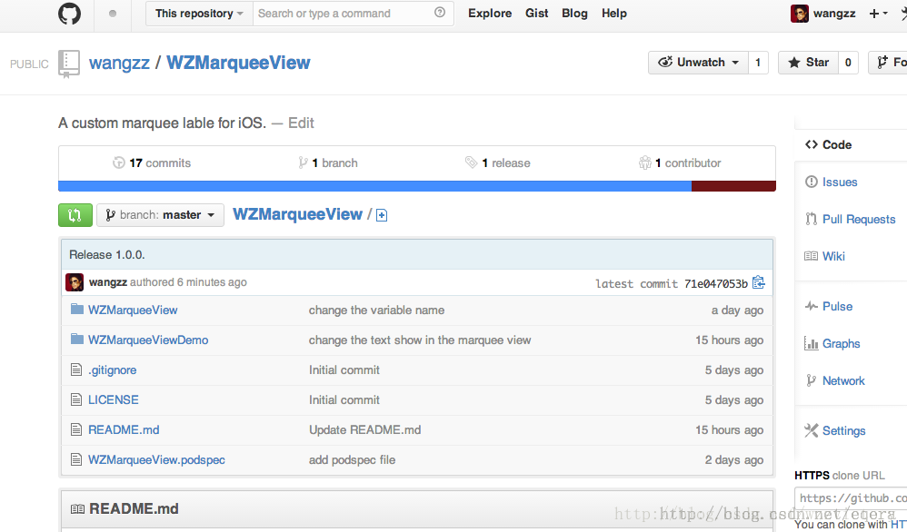

经过步骤三，向本地的git仓库中添加了不少文件，现在需要将它们提交到github仓库中去。提交过程分以下几步：
1、pod验证

执行以下命令：

$ set the new version to 1.0.0  
$ set the new tag to 1.0.0  
这两条命令是为pod添加版本号并打上tag。然后执行pod验证命令：
 
 

$ pod lib lint  
如果一切正常，这条命令执行完后会出现下面的输出：
 
-> WZMarqueeView (1.0.0)  
  
ZMarqueeView passed validation.  
到此，pod验证就结束了。
需要说明的是，在执行pod验证命令的时候，打印出了任何warning或者error信息，验证都会失败！如果验证出现异常，打印的信息会很详细，大家可以根据对应提示做出修改。
2、本地git仓库修改内容上传到github仓库

依次执行以下命令：

$ git add -A && git commit -m "Release 1.0.0."  
$ git tag ‘1.0.0‘  
$ git push --tags  
$ git push origin master  
上述命令均属git的范畴，这里不多述。如果一切正常，github上就应该能看到自己刚添加的内容了。如下图所示：
