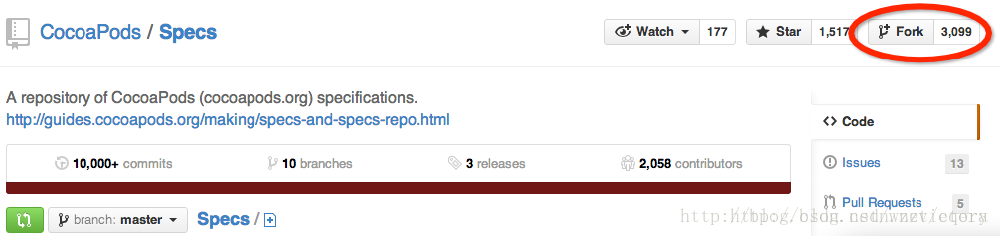
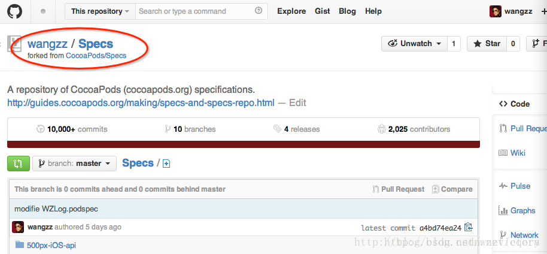
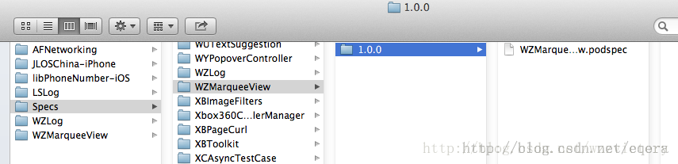
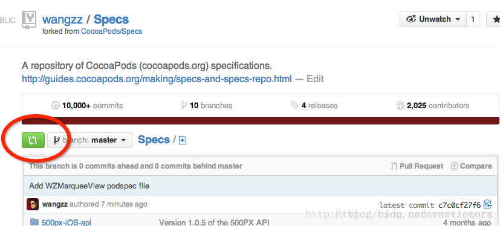
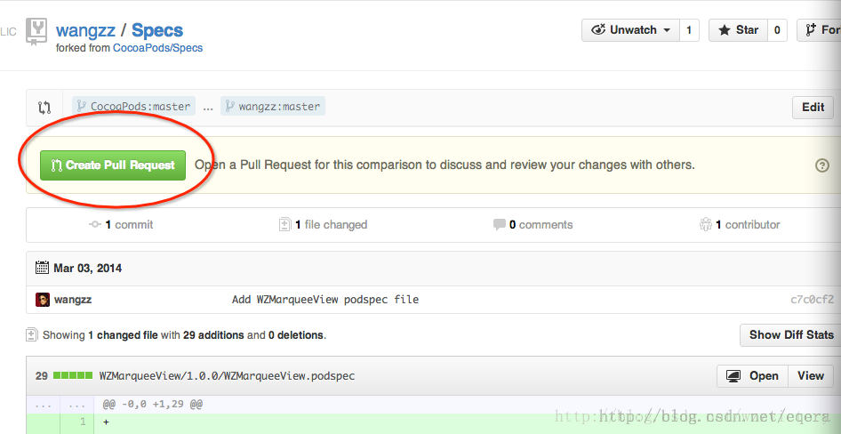
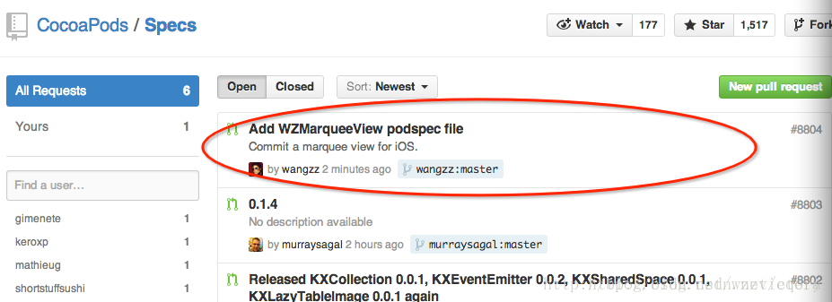

经过前边的四步操作，你可能以为已经结束了，不幸的是还早着呢。
要想一个Pods依赖库真正可用，还需要做最后一步操作，将我们刚才生成的podspec文件上传到CocoaPods官方的Specs仓库中，链接为：https://github.com/CocoaPods/Specs
打开这个链接你就会发现，原来我们能使用的，以及我们使用pod search命令能搜索到的所有Pods依赖库都会把它们的podspec文件上传到这个仓库中，也就是说，只有将我们的podspec文件上传到这个仓库中以后，才能成为一个真正的Pods依赖库，别人才能正常使用！
按照git的规则，要想向别人的仓库中添加文件，必须先fork一份别人的仓库，做完相应地修改后，在push给仓库的原作者，等到作者审核通过，然后合并到原来的仓库中。
流程明白了以后，自然知道该怎么干了：

1、fork一份CocoaPods官方的Specs仓库

进入到刚才的官方仓库链接中，点击屏幕右上角的fork按钮，如下图：


然后大家会发现自己名下会多一份仓库的分支。比如我的分支为：


2、将fork的仓库clone到本地

####执行以下命令：
```ruby
git clone https://github.com/wangzz/Specs.git 
```
 
注意，大家需要将对应的仓库地址换成自己的。
这个仓库有点大，需要有耐心啊。
 
3、将自己的podspec文件添加到本地Specs仓库中

Specs仓库clone到本地后，会放到一个名为Specs的文件夹中。podspec文件在Specs仓库中的保存原则是：
Pods依赖库同名文件夹--->版本号同名文件夹--->podspec文件
照此原则，我需要在Specs文件夹下建立一个名为WZMarqueeView的文件夹，然后进入到WZMarqueeView文件夹下，建立一个名称为1.0.0的文件夹，最后进入到1.0.0这个文件夹下，并且将之前创建好的WZMarqueeView.podspec文件拷贝进来。
不难理解，如果以后有对WZMarqueeView类的升级，就在WZMarqueeView文件夹下建立对应版本名称的文件夹，用于保存对应版本的podspec文件即可。
这些操作完成后，目录层次结构如下所示：


4、上传本地Specs仓库中的修改到github仓库

执行以下命令：

```ruby
git add -A && git commit -m "Add WZMarqueeView podspec file" 
git push origin master  
```

成功以后就能在github上自己fork的Specs仓库中看到刚上传的文件了。
 
5、将在自己fork的Specs上做的修改pull给CocoaPods官方的Specs仓库

进入到自己fork的Specs仓库中，会看到屏幕左上角有一个绿色按钮


该按钮点进去以后会有如下图所示的界面：


点击图中的绿色Create Pull Request按钮，即可将我们fork的Specs上做的修改pull给CocoaPods官方的Specs仓库。
 
到这一步后，剩下的工作就只有等了，等待CocoaPods的维护人员审核并将我们pull上去的修改合并到官方的Specs仓库中，这个过程通常会有一天左右的等待时间。如果有任何消息，比如审核不通过，或者审核通过了，CocoaPods官方都会发邮件通知的。
等到审核通过的时候，我们就能在官方的Specs仓库中看到自己上传的文件夹了。
6、查看审核进度

当然我们也能查看审核进度，打开这个链接：https://github.com/CocoaPods/Specs/pulls，这里能看到所有的Specs仓库pull请求，如下图：



红圈标识的就是我刚才pull上来的请求，点进去以后就能看到对应的审核进度。